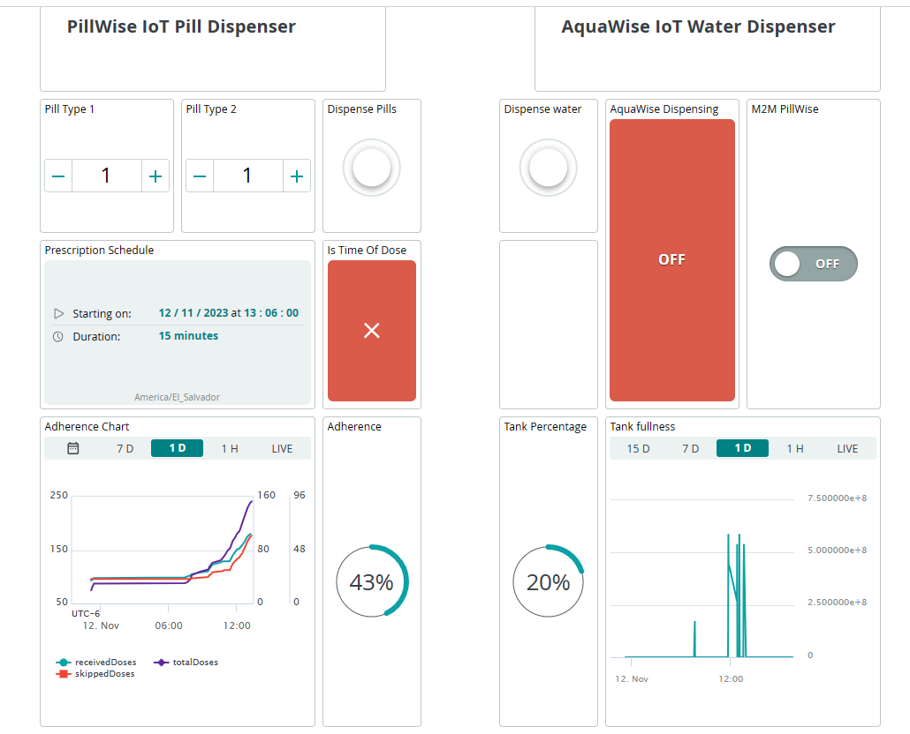

# PillWise-Med-System
To replicate the PillWise Medication System project, go to Arduino IoT Cloud and create two things with the following variables (note that Maker tier account is needed):
## 1. PillWise variables
   
## 2. AquaWise variables
  

Then use the provided source code to program the things respectively. For schematics and further documentation refer to the paper of this project.

# PillWise Dashboard
Create the following dashboard, associating the respective variables to its widgets.
  

## Triggers
In order to have notifications, the following triggers should be added:
* __Its Time Of Dose:__ Associated with the PillWise _isDispensingEnable_ variable.
* __Thanks for med:__ This one is associated to the PillWise _dispenseButton_ variable.
* __Medication Not Received:__ Associated to the PillWise _notReceived_ variable.
  
Feel free to use the type of notification you want, and to also add a custom message to it.
